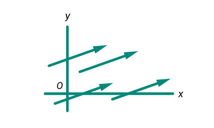
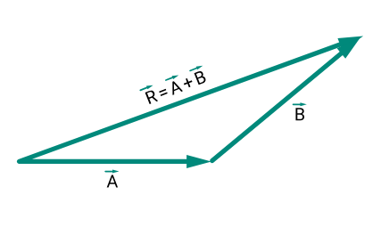
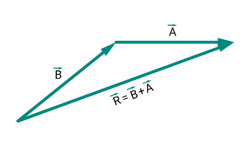

# Vectores y sus propiedades

- Los vectores son herramientas gráficas que permiten representar magnitudes físicas con dirección y sentido. A continuación, se presentan situaciones que describen propiedades y operaciones fundamentales con vectores:

## Equivalencia de vectores

- Cuatro vectores son iguales si tienen el mismo módulo (longitud), dirección y sentido.

## Suma de vectores – regla del triángulo

- El vector resultante R se obtiene al unir el extremo de A con el origen de B, formando un triángulo.

## Suma de vectores - regla del paralelogramo

- El vector resultante R se obtiene al colocar A y B en un mismo origen y completar un paralelogramo; su diagonal representa la resultante. 

 

# Operaciones con vectores

- Las operaciones básicas con vectores permiten combinar o modificar magnitudes vectoriales siguiendo reglas definidas. A continuación, se describen las principales:

* Igualdad de vectores : Dos vectores A y B son iguales (A = B) si tienen la misma magnitud y dirección.

* Suma de vectores: La suma de dos vectores se obtiene aplicando la regla del paralelogramo. Se construye un paralelogramo con los vectores A y B como lados adyacentes; la diagonal que parte del punto común corresponde al vector resultante R.

* Negativo de un vector: El vector negativo tiene la misma magnitud, pero dirección opuesta. La suma de un vector y su opuesto es cero: A + (-A) = 0.

* Resta de vectores: La resta A - B equivale a sumar A con el negativo de B: A - B = A + (-B).

* Multiplicación de un vector por un escalar: Multiplicar o dividir un vector por un número real (escalar) genera otro vector con la misma dirección, pero con módulo modificado. Ejemplo: si A es un vector, 4A es un vector cuatro veces mayor en magnitud que A.

