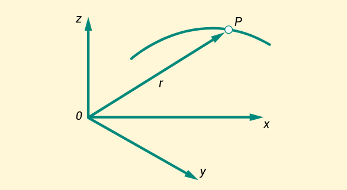
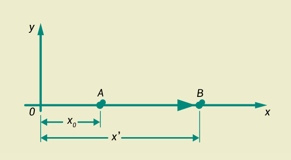
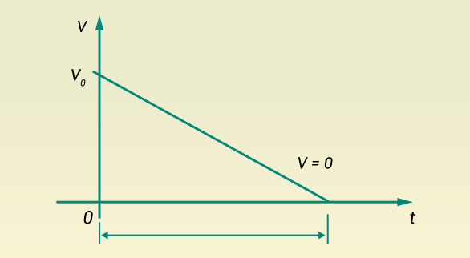

# CINEMATIC

- La cinemática es la rama de la mecánica que describe el movimiento de los objetos sólidos sin considerar las causas (fuerzas) que lo originan. Su estudio se centra en las trayectorias y su variación en función del tiempo, analizando los cambios de velocidad y aceleración con respecto a la posición y al tiempo.

    * Figura 1.Trayectoria de una partícula (P) en el plano (x, y, z).

## 2.1 Conceptos básicos

- Un objeto está en movimiento cuando su posición cambia con respecto a otro en el transcurso del tiempo. Por ejemplo, si una persona pasa junto a un poste de energía, se evidencia un cambio de posición respecto al poste, que actúa como referencia fija. Un objeto está en reposo cuando no presenta variación de posición en el tiempo. Por ejemplo, una estatua instalada frente al poste permanece en reposo respecto a este.

- El sistema referenciado depende del punto de observación. Una persona que conduce un automóvil está en movimiento relativo respecto a un observador fijo, pero estará en reposo relativo respecto a quien se encuentre dentro del vehículo.

- El plano de coordenadas cartesianas permite ubicar objetos en el espacio y representar gráficamente relaciones matemáticas de posición o movimiento.

    * En dos dimensiones (2D) se consideran los ejes x y y → plano (x, y).

    * En tres dimensiones (3D) se añade el eje z → plano (x, y, z).

- El sentido del movimiento depende del recorrido del objeto y puede ser positivo (+) o negativo (-), indicando avance o retroceso.

### Conceptos fundamentales de la cinemática

- Para comprender el estudio del movimiento, la cinemática utiliza magnitudes y elementos clave que permiten describirlo de manera precisa. A continuación, se presentan los principales conceptos, junto con su definición:

    * Partícula: Es una parte muy pequeña de algún objeto; para el caso de estudio de la física es un cuerpo material con pequeña dimensión de la materia.

    * Materia: Es el componente principal de los cuerpos, objetos o partículas, puede tener cualquier forma y también sufre cambios de acuerdo con las propiedades físicas o químicas.

    * Tiempo (t): Es una magnitud escalar con la que se mide la duración de los eventos, este permite establecer la diferencia entre los sucesos del pasado y las predicciones del futuro.

    * Distancia: Es la longitud recorrida por un cuerpo de un punto a otro, por ejemplo del punto A al punto B, o ubicados en el plano cartesiano, del punto (x0, y0) al (x1, y1). Indica el desplazamiento de la partícula.

    * Velocidad (v→): Es una magnitud vectorial la cual indica que tiene dirección y sentido, se calcula dividiendo la distancia por la unidad de tiempo empleado en hacer ese recorrido.

    * Rapidez (v): Es una magnitud escalar que es el módulo de la velocidad, relaciona la distancia que recorre una partícula y el tiempo que tarda en el recorrido.

    * Aceleración (a): Es una magnitud vectorial que relaciona la variación de la velocidad con el tiempo.

    * Aceleración de la gravedad (g): Es una magnitud vectorial que, obedece a la aceleración experimentada debido a la gravedad que ejerce la tierra en un cuerpo al dejarlo caer.

- El mundo está en constante movimiento; los objetos cambian su posición con respecto al tiempo por diversas razones. Dentro de la cinemática, uno de los movimientos más simples es el Movimiento Uniforme (MU) o Movimiento Rectilíneo Uniforme (MRU). Este ocurre cuando un objeto se desplaza en línea recta a una velocidad constante, lo que implica que su aceleración es nula (a = 0).

- En este tipo de movimiento:

    * La velocidad se mantiene constante.

    * La dirección no cambia durante el recorrido.

    * La distancia recorrida puede calcularse multiplicando la velocidad por el tiempo.

### Ecuaciones del MRU

- Para representar el comportamiento del Movimiento Rectilíneo Uniforme, se utilizan las siguientes ecuaciones:

    x=x0 +v*t

    v=v0=cte

    a=0

    Donde:

    x = posición final

    x0 = posición inicial

    v = velocidad constante

    t = tiempo

    a = aceleración nula

- Figura 2.Descripción del desplazamiento de una partícula desde el punto 0 al punto A y luego del punto A al punto B.

 

## 2.3 Movimiento Uniformemente Acelerado (MUA)

- El Movimiento Uniformemente Acelerado (MUA), también denominado Movimiento Rectilíneo Uniformemente Acelerado (MRUA) o Movimiento Rectilíneo Uniformemente Variado (MRUV), se diferencia del Movimiento Uniforme (MU) en que la partícula está sometida a una aceleración constante. En este tipo de movimiento:

    La velocidad de la partícula cambia de forma uniforme en el tiempo.

    La aceleración mantiene un valor constante (positiva si acelera, negativa si desacelera).

    La trayectoria sigue siendo rectilínea.

### Ecuaciones del MUA

- Para describir matemáticamente el Movimiento Uniformemente Acelerado, se emplean las siguientes ecuaciones:

    v= v0 + a*t

    x= x0 + v0 * t + 1/2a * t2

    a=cte.

    Donde:

    v= velocidad final

    v0 = velocidad inicial

    x = posición final

    x0 = posición inicial

    a = aceleración constante

    t = tiempo transcurrido

- Figura 3.Movimiento de una partícula que desacelera hasta alcanzar velocidad cero (v=0).

