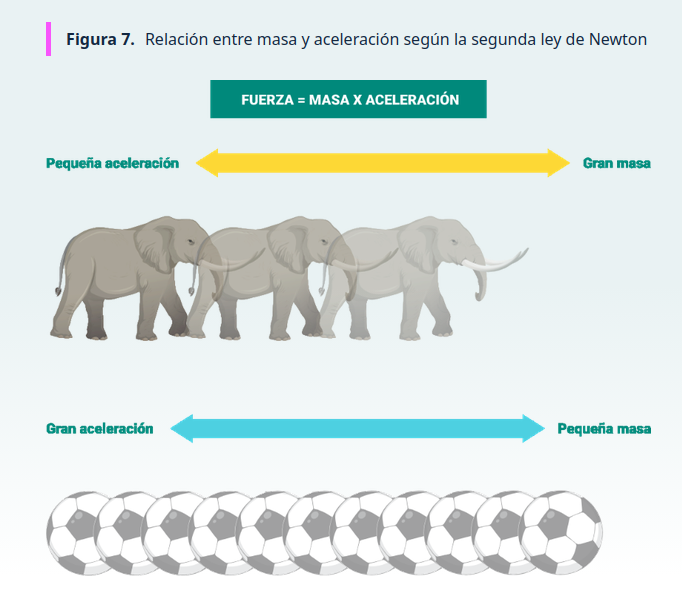
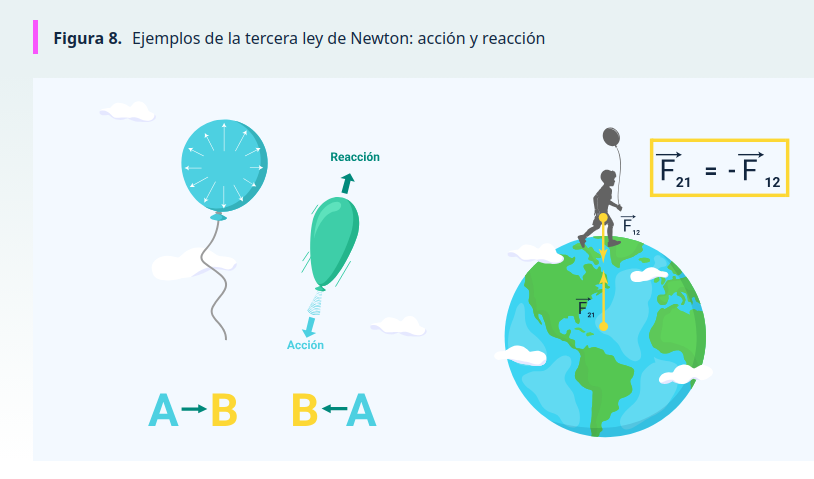

# DINAMICA

- Este video presenta los fundamentos de la dinámica en física, explicando cómo los cuerpos se mueven y cómo las fuerzas influyen en su comportamiento. A través de ejemplos y referencias históricas, se introduce la primera ley de Newton o ley de inercia, que describe cómo un objeto mantiene su estado de reposo o movimiento rectilíneo uniforme a menos que una fuerza externa actúe sobre él. Además, se abordan conceptos clave como masa, fuerza y gravedad, esenciales para comprender la interacción entre los cuerpos y el origen de sus movimientos.

VIDEO
URL: https://www.youtube.com/watch?v=zoMnLVttjmU

- El siguiente video explica los conceptos fundamentales de la física relacionados con las fuerzas que actúan sobre los cuerpos. Presenta la gravedad como la fuerza que atrae los objetos hacia la Tierra y muestra cómo el peso resulta de multiplicar la masa por la aceleración gravitacional. También describe la fuerza normal, la tensión, las fuerzas de roce estático y cinético, y la torsión, que provocan interacciones y movimientos en los cuerpos. Estos conceptos son la base para comprender cómo los objetos reaccionan ante distintas fuerzas en su entorno.

VIDEO
URL: https://www.youtube.com/watch?v=OT7dj0guS8E

 

## 3.1 Segunda ley de Newton

- La segunda ley de Newton establece que la aceleración de un objeto es consecuencia de la fuerza neta que actúa sobre él. Esta relación se expresa mediante la siguiente ecuación de fuerza:

F = m * a

Donde:

    F es la fuerza neta aplicada sobre el objeto (en newtons, N).

    m es la masa del objeto (en kilogramos, kg).

    a es la aceleración producida (en metros por segundo al cuadrado, m/s²).

- Esta ley indica que, a mayor fuerza aplicada, mayor será la aceleración del objeto, siempre que su masa se mantenga constante. Por el contrario, si la masa es mayor, la aceleración producida por la misma fuerza será menor.

- Esta figura presenta cómo la masa de un objeto influye en su aceleración según la segunda ley de Newton: los cuerpos con gran masa, como los elefantes, presentan una aceleración pequeña ante una misma fuerza, mientras que los objetos con menor masa, como los balones, logran una aceleración mayor con la misma fuerza aplicada.

 

## 3.2 Equilibrio dinámico

- En las personas, el equilibrio dinámico es la capacidad de mantenerse erguido y estable mientras se realizan movimientos o acciones, lo cual se logra ajustando el punto de gravedad. En otras palabras, un cuerpo permanece estable frente a las fuerzas que actúan sobre él cuando se generan procesos opuestos de igual magnitud, es decir, la suma de las componentes (x, y) de las fuerzas debe ser igual a cero. Se habla de equilibrio estático cuando las fuerzas que actúan sobre un cuerpo se encuentran balanceadas.

 

## 3.3 Tercera ley de Newton

- La tercera ley de Newton, conocida como ley de acción y reacción, establece que si un objeto (A) ejerce una fuerza sobre otro objeto (B), este último aplica una fuerza de igual magnitud, pero en sentido contrario sobre el primero. Matemáticamente, se expresa así:

FAB = -FBA

- Esto significa que la fuerza que A ejerce sobre B es igual y opuesta a la que B ejerce sobre A.

- La figura representa la tercera ley de Newton, presentando que toda acción genera una reacción de igual magnitud y en sentido opuesto. Se evidencia con un globo que se eleva al expulsar aire y con la fuerza gravitacional entre la Tierra y una persona, donde ambas ejercen fuerzas iguales y opuestas.

 

## 3.4 Inercia rotacional de los cuerpos sólidos

- La inercia rotacional es un valor escalar que describe la propiedad de los cuerpos sólidos de girar alrededor de un eje y depende de cómo se distribuye la masa respecto a dicho eje. También representa la dificultad que tienen los objetos para cambiar su velocidad de rotación. Cuanto más alejada esté la masa del eje de rotación, mayor será la inercia rotacional.

- Esta magnitud se relaciona con la segunda ley de Newton porque el movimiento genera una fuerza denominada tangencial, que depende de la aceleración tangencial y de la masa del objeto. Las ecuaciones principales son:

- I = m r²
Fuerza tangencial (Ft): Ft = m aT = m R α

- Donde:

    I es la inercia rotacional.

    m es la masa del cuerpo.

    r o R es la distancia de la masa al eje de rotación.

    aT es la aceleración tangencial.

    α es la aceleración angular.

## 3.5 Equilibrio rotacional

- El equilibrio rotacional ocurre cuando un objeto no presenta tendencia a girar, ya que no existe una torsión neta que genere rotación. Este principio es similar a la primera ley de Newton: si no actúa una fuerza externa, el cuerpo permanece en equilibrio. En el caso rotacional, el objeto se mantiene sin cambios en su movimiento de giro porque las fuerzas que podrían producirlo están ausentes o balanceadas. Es importante señalar que un objeto en reposo no necesariamente está libre de fuerzas, sino que estas pueden estar equilibradas, anulando cualquier movimiento.

## 3.6 Ley de gravitación universal

- La ley de gravitación universal de Newton establece que todos los cuerpos con masa se atraen entre sí con una fuerza proporcional al producto de sus masas e inversamente proporcional al cuadrado de la distancia que los separa. Su expresión matemática es:

- F = G (m₁·m₂) / r²

- Donde:

    F es la fuerza de atracción gravitacional entre los cuerpos.

    m₁ y m₂ son las masas de los cuerpos que interactúan.

    r es la distancia entre los centros de masa de ambos cuerpos.

    G es la constante de gravitación universal.

- Esta ley explica fenómenos como la caída de los objetos hacia la Tierra y la interacción gravitacional entre planetas y estrellas.

