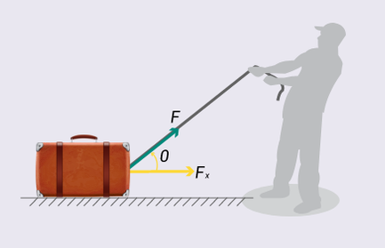

# Conservación de la energía

- Este video aborda el principio de conservación de la energía, explicando que la energía en un sistema no se crea ni se destruye, solo se transforma entre diferentes formas. Se analiza especialmente la energía mecánica, que resulta de la suma de la energía cinética —asociada al movimiento— y la energía potencial, que depende de la posición de un cuerpo. A través de ejemplos visuales, se muestra cómo la energía puede transformarse de potencial a cinética sin perderse, siempre que no intervengan fuerzas externas o fricción.

VIDEO
URL: https://www.youtube.com/watch?v=6lW2cukYVCs

 

## 4.1 Trabajo efectuado por una fuerza (constante y variable)

- El trabajo (W) es una magnitud escalar que resulta de la acción de una fuerza (F) sobre un cuerpo para desplazarlo una distancia (d). Este proceso implica la transferencia de energía, permitiendo que el objeto se mueva. La fuerza es una magnitud vectorial, y sus componentes en los ejes cartesianos son:

    * Fx = F cos θ

    * Fy = F sen θ

-  Trabajo efectuado por una fuerza constante

    - Se produce cuando la fuerza aplicada es paralela al desplazamiento y no cambia en el tiempo ni en la posición. La ecuación para calcularlo es:

    - Figura 9.Aplicación de fuerza sobre un objeto con descomposición en componentes

    

    - W = F * d = (F cos θ) * d = F d cos θ

    - Si θ = 0°, el trabajo se calcula como W = F d, ya que la fuerza y el desplazamiento tienen la misma dirección.

    - Si θ = 180°, el trabajo es W = -F d, indicando que la fuerza se opone al desplazamiento.

    - Su unidad en el Sistema Internacional (S.I.) es el Newton por metro (N·m), denominado Joule (J)

- Trabajo efectuado por una fuerza variable

    - Ocurre cuando la fuerza aplicada cambia en magnitud, dirección, posición u otro factor a lo largo del desplazamiento. En estos casos, el objeto se mueve en pequeños intervalos, donde la fuerza se considera casi constante en cada tramo. Un ejemplo claro es el trabajo realizado al estirar un resorte. Para alargarlo se requiere una fuerza creciente, proporcional a la deformación, según la ley de Hooke: